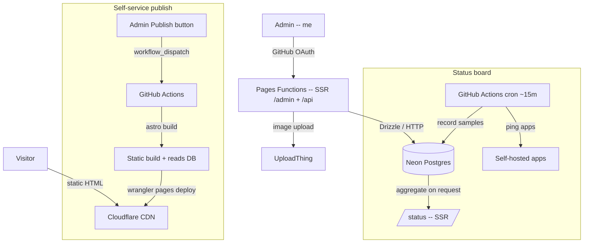

# karots-portfolio

Personal portfolio **and** a small admin CMS for **Mohammed Sheik Adhnan** (`karots.lk`) —
backend & DevOps engineer. The public site is statically generated and served from
Cloudflare's edge; the `/admin` CMS is server-rendered, GitHub-OAuth protected, and writes
straight to Postgres. It also runs a **live uptime board** backed by a real healthcheck job.

> Not a template — every page is driven by real content in the database, edited through the
> CMS, and published to production by a button.

**Live:** [karots.lk](https://karots.lk) · [karots.lk/status](https://karots.lk/status)

---

## Architecture

A **hybrid** Astro app: public routes prerender to static HTML (cheap, fast, CDN-cached),
while `/admin` and `/api` opt out of prerendering and run as Cloudflare Pages Functions with
live database access. One codebase, two runtimes.



### Why these choices

- **Static + SSR hybrid (Astro + `@astrojs/cloudflare`).** Public pages have no per-request
  DB cost and are edge-cached; only the handful of authenticated/admin routes pay for SSR.
  `prerender = false` is set per-route, so the split is explicit and auditable.
- **Direct-upload Pages + GitHub Actions (not a CF deploy hook).** The project is a
  direct-upload Pages project, so there's no native Git build. Instead the admin **Publish**
  button calls the GitHub API (`workflow_dispatch`) to trigger a build that reads the latest
  DB content and runs `wrangler pages deploy` — giving non-technical, one-click publishing
  while keeping builds reproducible in CI.
- **Neon + Drizzle.** Neon's HTTP driver works identically in Node (build/scripts) and on
  Cloudflare Workers (SSR), so a single `getDb()` covers both. Drizzle keeps the schema and
  row types in one typed source of truth.
- **Stateless JWT sessions (jose, HS256).** No session store to run or scale — the signed
  `admin_session` cookie is verified in middleware on each request. Auth is GitHub OAuth
  (arctic) gated to a single allowed login.
- **Real uptime, not a badge.** A scheduled job pings the self-hosted apps and records
  samples to Postgres; `/status` aggregates them live. The "zero downtime" claim on the home
  page links to data that proves it.

---

## Stack

Astro 5 · TypeScript · Tailwind CSS v4 · Drizzle ORM · Neon (Postgres) ·
Cloudflare Pages/Workers · Arctic (GitHub OAuth) · jose (sessions) · UploadThing ·
Toast UI Editor (WYSIWYG) · Shiki (code highlighting).

## Features

- Public site: projects (with **case-study** detail pages — problem/approach/outcome,
  impact metrics, architecture diagram), blog (WYSIWYG-authored), about, RSS, full SEO
  (JSON-LD, sitemap, OG images).
- Admin CMS: CRUD for profile, projects, blog, experience, education, skills, monitors, and
  contact messages — all behind GitHub OAuth.
- Self-service publish + live `/status` uptime board.
- Generated downloadable CV PDF and OG images.

## Local development

```bash
bun install
cp .env.example .env            # fill DATABASE_URL + GitHub OAuth creds
cp .dev.vars.example .dev.vars  # mirror non-public values for wrangler
bun run db:push                 # apply schema to Neon
bun run db:seed                 # seed profile/projects/blog/monitors from source data
bun run dev                     # http://localhost:4321
```

## Scripts

| Script | Purpose |
|---|---|
| `bun run dev` | Astro dev server (with Cloudflare platformProxy) |
| `bun run build` | Static build + Worker bundle |
| `bun run preview` | Preview the built output via wrangler |
| `bun run db:push` | Push Drizzle schema to the database |
| `bun run db:migrate` | Run generated SQL migrations |
| `bun run db:studio` | Drizzle Studio (browse data) |
| `bun run db:seed` | Seed initial content |
| `bun run healthcheck` | Ping status-board monitors and record samples |
| `bun run cv:pdf` | Generate the downloadable CV PDF |

## CI / CD

- **`.github/workflows/deploy.yml`** — on push to `main` (and `workflow_dispatch` from the
  Publish button): build, then `wrangler pages deploy`. Secrets: `DATABASE_URL`,
  `CLOUDFLARE_API_TOKEN`, `CLOUDFLARE_ACCOUNT_ID`; optional build var `GITHUB_READ_TOKEN`.
- **`.github/workflows/healthcheck.yml`** — every ~15 min: ping monitors → record to Neon.

## Environment

See `.env.example`. Secrets (`.env`, `.dev.vars`) are gitignored. In production, set these as
Cloudflare Pages secrets/vars. Notable optional vars: `GITHUB_DISPATCH_TOKEN` (Publish
button), `GITHUB_READ_TOKEN` (build-time GitHub presence on `/about`), `UPLOADTHING_TOKEN`
(admin image uploads).

## Project structure

```
src/
  components/   shared UI + admin form widgets
  layouts/      page shells (Base + Admin)
  pages/        public routes + /admin (SSR) + /api (SSR) + /status (SSR)
  db/           Drizzle schema + connection
  lib/          env, auth, content + GitHub helpers
  styles/       global.css (terminal-tech design system)
scripts/        seed, healthcheck, CV + OG generation
.github/        deploy + healthcheck workflows
```
